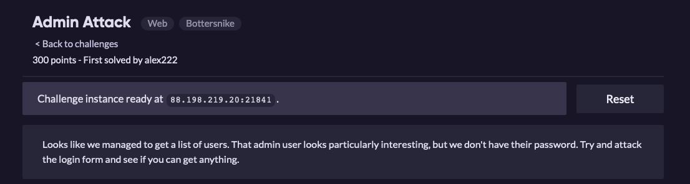
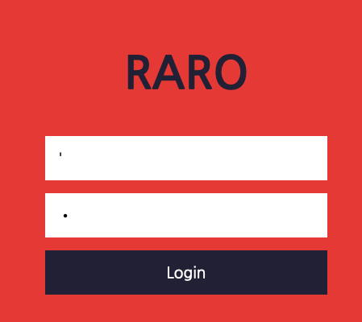
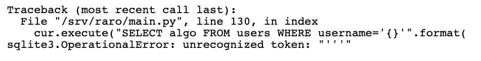
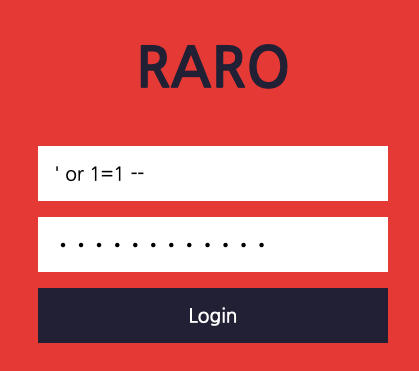

# Admin Attack

Essa é uma chall bem simples que pode ser explorada com SQL Injecion.  
Assim que abrimos a URL, podemos ver uma página WEB de autenticação esperando um usuário e senha.  

Começando pelo básico, vamos verificar se o código apresenta falhas ao tratar aspas simples.

Check!! Vemos então a falha da aplicação ao tentar realizar a query e também já sabemos que o alvo utiliza SQLite.

Agora que já sabemos seu ponto fraco, é hora de explorar.  
Iremos injetar o seguinte código no campo `username` e no campo `password`: **' or 1=1 --**

E então vamos ter o seguinte resultado.

